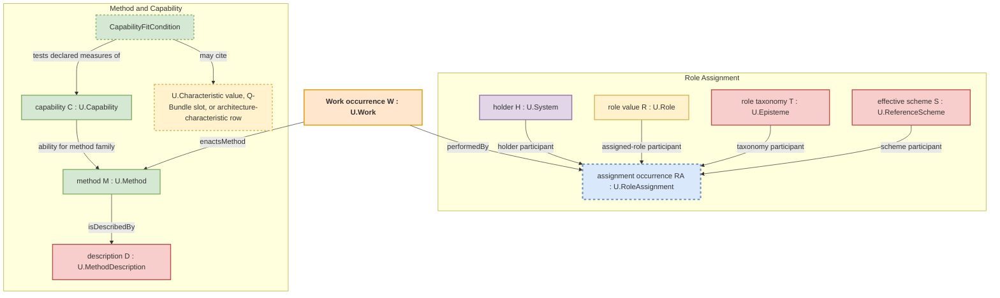

## A.15 - Role–Method–Work Alignment

> **Type:** Architectural (A)
> **Status:** Stable
> **Normativity:** Normative unless marked informative

**At a glance.** This pattern is the enactment-alignment pattern for engineer-managers when the real confusion is not "what component is this" but `who is responsible`, `how the work is supposed to happen`, `when the plan applies`, and `what actually happened`.

**Use this when.** Use this pattern when the real job is to separate role, method, plan, holder `U.Capability` instance, any capability statement or currentness assessment relied on, capability-fit checks, and performed work before a team treats one cue, one schedule, one display, one copied or generated statement, or one document as if it already counted as the role assignment, the method, the work plan, execution evidence, or the work itself.

**Start here when.** The dominant ambiguity is role vs method vs schedule vs performed work occurrence, and the team keeps arguing over encountered "process" wording without separating recipe, plan, capability, and executed work.

**First output.** One explicit separation of `U.Role`, `U.Method`, `U.MethodDescription`, `U.WorkPlan`, `U.Work` as the admitted kind, one dated Work occurrence admitted under that kind, and any separate assertion or description about it, plus the shortest traceable chain that already exists from `U.RoleAssignment` through the governing `U.Method` and its `methodDescriptionRef` or `U.MethodDescription` reference to the intended `U.WorkPlan` or actual Work occurrence, or an explicit source-relation gap that blocks admission of the claim.

**Working enactment-alignment sequence.** Role, method, plan, and work confusion -> separate the role, holder, role-taxonomy episteme, effective reference scheme, method description, intended `U.WorkPlan`, `U.Work` kind, actual dated Work occurrence, and any record about it -> choose proceed, plan, bounded probe, narrow, apply the direct governing pattern for any non-A.15 claim, or stop -> output the smallest alignment frame needed for the next work-family use -> use `A.15.4` only when an encountered episteme publication, display, credential view, explanation, copied statement, provenance mark, dashboard tile, schema wording, API wording, or composed source-relation chain begins to carry or justify a work claim or reliance claim.

**Working alignment applications.**
1. Name the role, holder, exact role-taxonomy episteme, and effective reference scheme under repair.
2. Name the method or method description that is meant to govern the work.
3. Name the intended `U.WorkPlan`, or identify the actual dated Work occurrence admitted under `U.Work` and keep any assertion or record about it separate.
4. Choose the next governed use: proceed inside the recovered relation, plan, run a bounded reversible probe, narrow scope, apply the governing FPF pattern and project-side FPF kind and reference named by value for the claim or effect being made, or stop.
5. If a reliance appearance such as a display, credential view, copied approval, generated explanation, publication face, or cue is being used by appearance for a work claim or reliance claim before the governing pattern position is named, apply `A.15.4` work-relevant appearance-based reliance repair to that claim; keep `A.15` only for the separation among `U.Role`, `U.Method`, `U.MethodDescription`, `U.WorkPlan`, `U.Work` as the admitted kind, each actual Work individual admitted under it, and every separate episteme about such an occurrence.

**Action-pattern protection.** This pattern is not about classifying encountered publications, displays, or cues. It keeps role, method, plan, holder `U.Capability` instance, separately governed capability-support records and relations, capability-fit checks, and performed work distinct so the acting engineer-manager can choose the next admissible work-family or reliance use. Work-relevant appearance-based reliance repair is handled by the related `A.15.4` cluster member.

**Minimum sufficient governed use.** Choose the minimum sufficient governed use, recover only the project-side FPF kind and reference named by value needed for that use, and do not raise the claim beyond that recovered relation, source, or admissible-use boundary.

**Recovered governing-reference sufficiency condition.** If the required project-side FPF kind and reference named by value is present and its scope and window match the role, method, plan, or work-family claim under repair, proceed inside that recovered scope and window. If not, narrow scope, run a bounded reversible probe, find the missing source relation, or create only the smallest `A.15.4` repair request, decision-request record, prospective work-plan entry, missing-source-relation note, or missing-source admission block needed for the next governed use.

**Ordinary use.** If the team only needs to separate role, method, plan, holder `U.Capability` instance, capability-fit checks, and performed work for orientation or planning, one separation sentence or small working card is enough.

**Reliance-bearing use.** Use the fuller alignment frame when a reliance appearance is about to guide planned work, performed work, role attribution, role-state attribution, release reliance, disputed responsibility, or use under another role taxonomy or reference scheme. Use `A.15.4` when the issue under repair is whether that appearance exposes the project-side FPF kind and reference named by value required for that work claim or reliance claim.

**Stop condition.** Stop once the separation changes no next admissible work-family use or reliance use and blocks no concrete overclaim about role, role-state, method, plan, work, approval, evidence, or release.

**Admissible-use examples.**

| Admissible project use | Source-finding or reversible probe | Non-admissible use |
| --- | --- | --- |
| A maintenance team names `PumpInspectorRole`, the inspection method description, and the current `U.WorkPlan`. After the inspection actually occurs, it identifies the dated Work occurrence admitted under `U.Work` and creates a separate inspection record that designates it. The plan, occurrence, and record remain distinct. | A short briefing says the inspection is ready, but the method description or work plan is missing; use the briefing only to find or repair the missing source before planned work proceeds. | A dashboard tile, copied approval, generated explanation, or briefing is used as the source for a work or reliance claim by appearance. Use `A.15.4` for appearance-based reliance repair. |

**Alignment frame in plain terms.** One alignment frame that keeps `U.Role`, `U.Method`, `U.MethodDescription`, `U.WorkPlan`, `U.Work` as the admitted kind, one actual Work individual admitted under it, and any episteme about that occurrence distinct, while exact `performedBy` and `enactsMethod` relations connect the occurrence to its `U.RoleAssignment` and `U.Method`; not a single work occurrence, not a checklist, not a language-style repair pattern, and not a mere cue note.

**First admissible work-family use in plain terms.** Keep role value, holder assignment, semantic method, method-description reference, intended work plan, and dated performed work distinct while making the chain between them inspectable enough for enactment, audit, and source-relation recovery.

**What goes wrong if missed.** Teams collapse role, recipe, plan, capability, and performed work occurrence into one fuzzy "process" label from project material, then mistake documentation for execution, capability for evidence, schedule for occurrence, or a narrower briefing for the relation that makes work admissible.

**What this buys.** One inspectable enactment frame that lets a team ask who held what role, which method governed, what plan existed, and what work actually occurred before treating follow-on work, blame, or approval as if those distinctions were the same.

**Not this pattern when.** Not this pattern when the honest need is only one dated work occurrence (`A.15.1`), only planning or schedule baseline (`A.15.2`), only work-entry readiness or full-kit preparation (`A.15.5`), only a cue note that has not yet become an enactment-alignment question (`A.16` or `A.16.1`), only boundary wording or policy wording without a role-method-work question under repair (`A.6` or `A.6.B`), or work-relevant appearance-based reliance repair for a display, credential view, copied approval, generated explanation, publication face, or similar reliance appearance (`A.15.4`).

**Related project records and governing patterns.** `A.15.1` governs dated Work occurrences admitted under `U.Work` and the boundary to separate assertions or records about them; `A.15.2` governs schedule or baseline planning records, `A.15.3` slot-filling plan items, `A.15.4` work-relevant appearance-based reliance repair, `A.15.5` work-entry readiness and full-kit preparation, `B.5.1` Explore -> Shape -> Evidence -> Operate for project progression, `F.11` method and work vocabulary alignment across contexts, and `F.17` the human-facing work sheet.

**Causal-use work boundary.** Realized counterfactual-sampling work, counterfactual randomization, intervention assignment, target-trial emulation work, and causal evidence collection remain separately represented here as `U.MethodDescription` epistemes, `U.WorkPlan` epistemes, and world-side Work individuals admitted under `U.Work` together with their exact role and method relations. `A.15` can say who performs which sampling or intervention work under which method and role; it does not make the resulting causal use admissible. `C.28` governs the causal-use question, `CausalityLadderRung`, causal estimand, `CausalEvidenceSupportBasis`, counterfactual sampling realizability, and supported use and unsupported use.

**Related-record mistakes.** If the first honest cue is still only a cue, keep it under `A.16` or `A.16.1`; if the question under repair is boundary wording, promise, agreement-like service, or policy wording, recover the corresponding `A.6` boundary-claim record; if you need one executed occurrence rather than the alignment frame, recover the dated Work occurrence under `A.15.1` and create or cite a separate assertion or record only when that episteme is also needed; if a reliance appearance is being used for a work relation or reliance relation, use `A.15.4`.

**Boundary to coarsened renderings.** A lighter briefing, summary, redacted note, or coarsened rendering may orient work or cue attention. It becomes sufficient for work execution, plan use, approval, gate decision, or execution evidence only when the required method, plan, approval, gate, or evidence source remains explicit and reopenable. Treat the coarsened-rendering relation through `A.6.3.CSC Controlled Semantic Coarsening` when the rendering itself changes what can be relied on.

**Use boundary.** Use `A.15` when the current project question needs role-method-work alignment. If the current claim is one single work occurrence, `A.15.4` repair note, wording repair, assurance claim, or encountered "process" label, use the governing pattern for that claim and keep only the A.15 separation that remains needed.

### A.15:1 - Problem frame

In any complex system, from a software project to a biological cell, there is a fundamental distinction between **what something is** (its structure), **which role a holder is assigned under an exact role-taxonomy episteme and effective reference scheme** (`U.Role` and `U.RoleAssignment`), **how work is done** (`U.Method` and `U.MethodDescription`), **which holder `U.Capability` instance is relied on** (`A.2.2`), **which statement, evidence relation, or currentness assessment supports that reliance**, **which separate capability-fit, threshold, gate, or admission check is applied when fit is current**, **what work is intended** (`U.WorkPlan`), **which world-side dated Work occurrence happened** (an individual admitted under `U.Work`), and **which separate assertion or record describes it**. Confusing these distinctions is a primary source of design flaws, budget overruns, and failed projects. Teams argue over encountered "process" wording without clarifying whether the FPF object under repair is a `U.Method`, a `U.MethodDescription`, a holder `U.Capability` instance, a statement about that instance, a separate capability-fit condition, a `U.WorkPlan`, an actual Work occurrence, or an episteme about that occurrence.

This pattern provides the canonical role-method-work enactment alignment in FPF. It applies the **Strict Distinction Principle (A.7)** to the passage from holder-in-role assignment and selected method to intended `U.WorkPlan`, an actual Work occurrence admitted under `U.Work`, and any separate episteme about it, without making A.15 the whole strict-distinction ontology. It weaves together current governing relations into a single, coherent model:
*   **A.2 and A.2.1:** Provide enactment-facing `U.Role` values and `U.RoleAssignment` as the typed assignment relation with exactly four generic participants: holder `U.System`, `U.Role`, exact role-taxonomy episteme, and effective `U.ReferenceScheme`. The actual assignment extent is the maximal continuous interval over which that relation obtains; declared windows and justification or source claims remain assertion or description content.
*   **A.15.2 and A.15.1:** Separate `U.WorkPlan` intent from actual dated Work occurrences admitted under `U.Work`, and separate both from assertions or records that designate them.
*   **A.3.1 and A.3.2:** Separate `U.Method` from `U.MethodDescription`, so recipes, algorithms, procedures, and encountered "process" wording do not become performed work by word choice.
*   **A.3.4:** Provides `U.Transformation` for bounded change under conditions when the actual change, affected entity, pre/post state, mechanism, method, or work relation is current.
*   **A.10, C.2.1, and E.17:** Keep evidence relations, source relations, publication relations, and carrier relations outside the work-facing role assignment unless a system or acting holon is actually assigned a role for performed work.

The intent of this pattern is to establish a normative, unambiguous vocabulary and set of relations for connecting holder-in-role assignment, recovered method, method-description reference, holder `U.Capability` instances when relied on, separate capability statements or currentness assessments when those are used, separate capability-fit conditions when current, intended work plan, actual dated resource-consuming Work occurrences admitted under `U.Work`, and separate epistemes about them.

To keep plan-occurrence separation explicit, this pattern references **A.15.2 `U.WorkPlan`** for **schedules and calendars** and **A.15.1** for admission under **`U.Work`** and identification of dated Work individuals. Ambiguous terms in project material, such as "process", "workflow", "activity", and "schedule", are handled by `E.10` and `E.10.ARCH`: recover the object under wording repair first, then assign the wording to `U.Method`, `U.MethodDescription`, `U.WorkPlan`, the `U.Work` kind or one Work individual admitted under it, or another direct governing pattern.

**Terminology note.** The words _action_ and _activity_ are not normative kernel names by themselves. When a generic "doing" cue appears, recover the FPF object or kind being claimed: **`U.Method`**, **`U.MethodDescription`**, **`U.WorkPlan`**, one Work individual admitted under **`U.Work`** or the kind itself when kind-level classification is current, or a neighboring governed value such as `U.Transformation`, `U.Dynamics`, evidence relation, gate relation, source relation, or publication use.

### A.15:2 - Problem

Without this formal framework, models suffer from a cascade of category errors:

1.  **Role-as-Part:** A Role (e.g., `AuditorRole`) is incorrectly placed inside a structural parts list (`ComponentOf`), making the system's architecture brittle and nonsensical.
2.  **Specification-as-Execution:** A `MethodDescription` (the "recipe") is treated as evidence that the work was done. This leads to "paper compliance," where a system is considered complete simply because its documentation exists.
3.  **Capability-as-Work:** A team's *ability* to perform a task (`Capability`) is conflated with the *actual performance* of that task (`Work`). This obscures the reality of resource consumption and actual outcomes.
4.  **Work-without-Alignment:** An instance of work is logged without a clear link back to the exact role assignment, recovered method, method-description reference, and capability-fit or admission condition that made it admissible, making the work unauditable and its results impossible to reproduce.
5.  **Ambiguous "process" or "activity" wording:** The overloaded term "process" is used indiscriminately to refer to all of the above, creating a fog of miscommunication. Repair generic doing or activity terms through `E.10` and `E.10.ARCH` to `U.Method`, `U.MethodDescription` (recipe), `U.WorkPlan` (schedule), one Work individual admitted under `U.Work` (performed occurrence), or another direct governing pattern.

### A.15:3 - Forces

| Force | Tension |
| :--- | :--- |
| **Structure vs. Enactment Alignment** | The need to model stable structural decomposition (`mereology`) vs. the need to model holder-in-role assignment, holder capability instances, capability support relations, capability-fit conditions, method, plan, and dated work occurrence. |
| **Method, plan, and occurrence** | The need for reusable method and description values, intended-work planning, and a specific dated record of performed work. |
| **Clarity vs. Jargon** | The need for a precise, formal vocabulary to prevent ambiguity vs. the reality that teams use informal, domain-specific wording like "process" or "workflow." |
| **Accountability vs. Complexity** | The need for a complete, end-to-end audit trail for every decision-relevant work occurrence vs. the desire to keep models simple and avoid excessive documentation. |

### A.15:4 - Solution

**Method and work governing-pattern cue.**
 When encountered "process", "algorithm", "solver", "workflow", "procedure", or similar wording points to changing, producing, selecting, deriving, controlling, or maintaining an `EntityOfConcern`, use `E.10.ARCH:3.1` to recover the object under wording repair first and then assign separately governed typed values. A.15 carries only the alignment among role, method, method-description, work-plan, and performed-work references. Formal substrate, mathematical-lens use, mechanism declaration or realization, evidence relation, gate relation, source relation, result, publication, and temporal claims are governed by their own patterns.

When methods are related to one another, A.15 keeps only the alignment use of that relation. The method-side object is the exact governed method relation structure under `A.3.1`, `A.3.2`, `G.5`, or a direct method-composition pattern when current. A method algebra, workflow graph, process calculus, matrix, category, embedding, or neural representation is a lens or method description over that structure, not a role relation, work plan, dated work occurrence, or assignment relation.
The solution is a stratified alignment that cleanly separates semantic method, method-description reference, holder-in-role assignment, holder `U.Capability` instances when relied on, separate capability statements or currentness assessments when those are used, separate capability-fit conditions when current, intended work plan, and dated performed work. The work-facing assignment relation is **`U.RoleAssignment`**.

#### A.15:4.1 - The Core Entities: A Strict Distinction

FPF mandates the use of the following distinct, non-overlapping entities to model method, plan, and work enactment. Using them interchangeably is a conformance violation.

**A) Role, Method, Description, Capability, And Plan Values:**

*   **`U.Role`:** A work-facing role value interpreted through one exact role-taxonomy episteme and effective `U.ReferenceScheme`. Expected contribution, responsibility, permission, commitment, obligation, capability-fit, and admission conditions are neighboring relations governed by their direct patterns; the role value is not the holder, assignment occurrence, method, capability, work plan, or work occurrence.
*   **`U.Method`:** The run-independent semantic way of doing a kind of transformation or enactment. It is not a dated performance or its description.
*   **`U.MethodDescription`:** A **`U.Episteme` describing a `U.Method`**; it may be expressed in an SOP, algorithm, proof, recipe, or other method-description publication.
*   **`U.Capability`:** The `A.2.2` admitted dependent durable U-kind for holder-dependent capability instances. A concrete instance is a `U.System` holder's ability to perform a work family or produce a result class within a declared envelope, measure set, qualification window, and currentness condition. A `CapabilityStatement`, evidence relation, source-use relation, or currentness assessment may support relying on that instance; a capability-fit condition may test it. The capability instance is not the method, method description, support record, fit predicate, work plan, or work occurrence.
*   **`U.WorkPlan`:** A **`U.Episteme`** declaring designators and constraints for possible future Work occurrences, including windows, dependencies, intended performers by role, and budgets. A future Work occurrence does not yet exist merely because a plan refers to it - see **A.15.2**.

**B) The Assignment Relation:**

*   **`U.RoleAssignment`:** The typed assignment relation for enactment-facing roles. Its generic signature has exactly four participant slots: holder `U.System`, assigned `U.Role`, exact role-taxonomy episteme, and effective `U.ReferenceScheme`. Its actual occurrence extent is derived as the maximal continuous interval over which those participants stand in the assignment relation. A declared assignment window, rationale, source, or selected `BoundedModelUseStructure` belongs to the receiving assertion, description, or use; none is an optional generic participant.

**C) Performed Occurrence:**

*   **`U.Work`:** The admitted kind for concrete dated work-occurrence holons. One Work individual is a world-side, resource-consuming enactment of a `U.Method` by a holder under a `U.RoleAssignment`; it has its own temporal extent and stands in actual performer, method, containing-system, affected-referent, binding, and resource-use relations when they obtain. Capability-fit checks are evaluated against the holder for that occurrence. Any `methodDescriptionRef`, log, ticket, assertion, description, or performed-work record is a separate `U.Episteme` that may designate the occurrence and state those relations; it is not the occurrence. The assignment occurrence has its own actual extent, derived separately from uninterrupted obtaining.

**Work individual and description boundary**

`U.Work` is the admitted kind for dated work-occurrence holons. One Work individual is a world-side occurrence that stands in actual `performedBy`, `enactsMethod`, temporal, `executedWithin`, affected-referent, binding, and resource-use relations when those relations obtain. An assertion, description, log, ticket, or other record about that occurrence is a separate `U.Episteme`: it may designate the Work individual and state those relations, but it is neither the occurrence nor a Work individual.

Do not add a universal `primaryTarget` field, a local `kind` field, or an Operational/Communicative/Epistemic enumeration to the occurrence. Recover the exact affected-referent, transformation, speech-act or commitment effect, episteme-handling, production, delivery, acceptance, or other relation through its direct governing pattern. The words operational, communicative, and epistemic may remain use cues; they do not define local Work subkinds by enumeration.

**Didactic Note for Managers: The "Chef" Analogy**

This model can be easily understood using the analogy of a chef in a restaurant.

*   **`ChefRole`** is the **Role**. It's a job title with certain expectations.
*   A **Cookbook (`U.MethodDescription`)** contains the **recipe** for a Souffle. It's a piece of knowledge.
*   The chef's **skill** in making souffles is their **`U.Capability`** instance. They have this skill even when they are not cooking, while a certificate or review about the skill is a separate support record.
*   `RestaurantRoles-2026` supplies the vocabulary for `ChefRole`, and `Restaurant-A-Role-Scheme` is the effective reference scheme. The restaurant rulebook is a separate episteme that may declare capability or work-admission conditions before cooking work is admitted; it is not a participant of the generic role assignment.
*   The actual act of **making a souffle** on Tuesday evening is one Work occurrence admitted under **`U.Work`**. Its exact temporal relation and separately obtaining resource-use relations connect that occurrence to the 25-minute extent, eggs, butter, and consumed gas when those facts obtain. A kitchen log that states them is a separate episteme.

Confusing these is like mistaking the cookbook for the souffle. FPF's framework simply makes these common-sense distinctions formal and mandatory.

#### A.15:4.2 - The Canonical Relations: Connecting the Layers

The entities are connected by precise relations that form a traceable alignment. The diagram keeps the four generic `U.RoleAssignment` participants visible and keeps method description, capability fit, and work occurrence outside that assignment signature.



*   **Capability-fit condition:** A method description, work plan, or separately governed work-admission assertion may state that the holder under a `U.RoleAssignment` must satisfy a capability threshold or envelope for a method or work claim. The fit condition tests the holder's `U.Capability` instance and may cite declared capability measures, `U.Characteristic` values, Q-Bundle slots, or architecture-characteristic criteria rows. The role value does not own the capability, the support record does not become the capability, and the fit condition is not a second capability kind.
*   **`isDescribedBy(Method, MethodDescription)`:** A `U.Method` is described by one or more `U.MethodDescription` epistemes. This keeps the run-independent way of doing distinct from the description and any publication that exposes it.
*   **`enactsMethod(W : U.Work, M : U.Method)`:** One exact Work occurrence `W` admitted under `U.Work` stands in `enactsMethod` to method `M` admitted under `U.Method`. A separate `performedBy` relation connects `W` to its role-assignment occurrence when that attribution obtains. Capability-fit checks are evaluated against the holder for that occurrence; the `U.MethodDescription` remains a separate episteme, and any admitted source remains under its separate source-use relation.
*   **`performedBy(W : U.Work, RA : U.RoleAssignment)`:** One Work occurrence `W` admitted under `U.Work` stands in `performedBy` to one exact assignment occurrence `RA` admitted under `U.RoleAssignment`. The assignment's four participants make holder, role meaning, role taxonomy, and effective interpretation scheme recoverable. A record may state this fact but does not carry the relation as a field that constitutes Work.

The assignment occurrence has the maximal continuous extent over which its four-participant relation obtains. A planned or asserted interval does not create that actual extent. A selected `BoundedModelUseStructure`, when it changes interpretation, is named in the receiving assertion or use. Only a genuinely structure-dependent relation species may require that structure as an identity-bearing participant, under its own direct pattern and stronger obtaining and identity law.

For a performed occurrence, this alignment lets the reader trace one Work individual admitted under `U.Work` through exact `enactsMethod` and `performedBy` relations to the `U.Method` it enacts and the exact `U.RoleAssignment`; a separate assertion may cite the `U.MethodDescription` used to identify or constrain that method. It does not turn the role taxonomy, reference scheme, method description, capability fit, plan, or evidence into the work itself.

#### A.15:4.3 - Bounded specialization scouting and `CheckpointReturn`

When one human-plus-AI pair faces a new task family or candidate solution family, the governed work system may temporarily compose four distinct local roles inside the same dyad: a human-held `OutcomeCriterionHolderRole`, an `AIScoutRole`, an `AISpecialistProbeRole`, and a human-held `CommitAuthorityRole`. The payoff of the dyad is faster admissible specialization of the next work-family use, not disappearance of the human decision step.

For this bounded dyadic work question, the pair declares one outcome criterion first, enumerates heterogeneous candidate approaches that may satisfy that target, spends a bounded scouting budget or probing budget before any committed approach is chosen, and returns one `CheckpointReturn` that compares the tested approaches rather than silently treating one successful probe as a committed rollout. `A.15` governs this dyadic alignment use and local role split only; it does not restate the checkpoint-record semantics of `C.24` or the budget and guard enforcement of `E.16`.

Every `CheckpointReturn` carries:
- the declared outcome criterion and current `TaskFamily`
- the candidate approaches actually tested
- the evidence observed on each tested approach, including progress toward the named work-measure threshold and important failure signals
- the budget already burned and the residual budget still available
- the recommended next work-family use or reliance use: continue probing, commit to planned work, narrow the method or claim, apply the direct governing pattern for a non-A.15 claim, or stop
- the commit trigger named by value that would justify leaving the bounded probe

The return is candidate-approach evidence, burned and residual budget amounts, observed result, and commit-trigger condition. It is not the selected method, `U.WorkPlan`, an actual Work occurrence admitted under `U.Work`, an execution-evidence relation, an evidence-provenance relation, or a rollout decision. Those claims need the project-side FPF kind and reference named by value before committed rollout.

Low-human-overlap approaches remain admissible here only while they stay tied to the declared outcome criterion, budget limits, and evidence relation or evidence-provenance relation by value.

#### A.15:4.4 - Boundary to A.15.4 Work-Relevant Appearance-Based Reliance Repair

Use `A.15.4` when an encountered episteme, episteme publication, display, credential view, generated explanation, copied statement, provenance mark, dashboard tile, schema wording, API wording, or composed source-relation chain is being used by appearance for a work claim, reliance claim, role-assignment currentness claim, role-state currentness claim, source-currentness claim, approval, authorization, gate passage, evidence, engineering justification, release reliance, or a claim about an actual Work occurrence.

`A.15` itself keeps the kernel separation: `U.Role`, holder, role-taxonomy episteme, effective reference scheme, `U.Method`, `U.MethodDescription`, `U.WorkPlan`, `U.Work` as the admitted kind, one actual dated Work occurrence, any separate episteme about it, and the `U.RoleAssignment` chain between them. The appearance-based reliance repair recovers the project-side FPF kind and reference named by value before the reliance appearance can carry the work claim, reliance claim, or effect claim being made; that repair belongs to `A.15.4` unless a direct governing pattern is already recoverable.

A principle scheme, functional diagram, scenario, screen, or explanation that makes an `E.18.1` P2W carry-through structure recoverable may help the team plan work or find the needed source.

#### A.15:4.4a - Method-Work Unfolding Linkage

Use `MethodWorkUnfoldingLinkage@Context` only when a constraint-governed unfolding structure depends on a method and work relation that must stay inspectable across A.3 and A.15-family records. The linkage is a dependent relation record owned by this role-method-work alignment family; it is not a root U-kind, not a method, not work, not work authorization, and not evidence or gate passage.

```text
MethodWorkUnfoldingLinkage@Context:
  kind: dependent relation/linkage record under A.15 and adjacent method, evidence, assurance, and gate governing patterns
  unfoldingStructureRef:
  methodRef?:
  methodRelationStructureRef?:
  methodDescriptionRefs[]:
  applicableRoleRefs[]:
  capabilityFitConditionRefs[]:
  transformationKindRefs[]:
  workPlanRefs[]:
  workEntryReadinessRefs[]:
  performedWorkRefs[]:
  evidenceRefs[]:
  assuranceRefs[]:
  gateRefs[]:
  stopOrReturnCondition:
```

`capabilityFitConditionRefs[]` points to A.2.2 capability-fit conditions for the method or work use. It is not a vague ability bucket, not a q-bundle by name, and not a measured characteristic unless `C.25`, `C.16`, or a characteristic or evaluation pattern is current.

When a CGUS, P2W, P2S, improvement-loop, or transformation-flow slice cites `methodWorkLinkageRef?`, the ref means only that this method and work relation needs to remain visible while the direct claims still keep their own authority. If a single direct claim is current, use its direct owner instead: `U.Method` or `U.MethodDescription` under A.3, work planning under `A.15.2`, work-entry readiness under `A.15.5`, an actual dated Work occurrence under `A.15.1`, evidence under `A.10`, assurance under `B.3`, and gate under `A.20` or `A.21`.

#### A.15:4.5 - Boundary to A.15.5 Work-Entry Readiness

Use `A.15.5` when the current question is whether intended work is ready enough to enter a work boundary. `A.15` keeps the role-method-work separation; `A.15.5` carries `WorkEntryReadiness@Context`, `FullKitCondition`, commitment disposition, resource-readiness refs, WIP or flow-policy refs, planned-baseline refs, and launch-gate refs when they are current.

Readiness is not performed work, not evidence sufficiency, and not gate passage by itself. A readiness-looking briefing, dashboard, source bundle, or P2W record may cue `A.15.5`, but the readiness relation is admitted only when the target work plan or plan item, missing inputs, preparation work if performed, planned baseline, and stop or degraded-use condition can be named.

### A.15:5 - Archetypal Grounding

The role-method-work alignment applies whenever the question under repair is holder-in-role, method description, intended plan, or performed work. Physical engineering, knowledge work, and socio-technical cases can all use the same distinction without turning A.15 into a universal process ontology.

| Archetype | **`U.System` Archetype (Manufacturing)** | **`U.Episteme` Archetype (Scientific Peer Review)** |
| :--- | :--- | :--- |
| **Role-taxonomy episteme** | `FactoryProductionRoles-2026` | `PhysicsPeerReviewRoles-2026` |
| **Effective `U.ReferenceScheme`** | `Factory-Line-B-Role-Scheme` | `PhysicsLetters-A-Review-Scheme` |
| **`U.Role`** | `WeldingRobotRole` | `PeerReviewerRole` |
| **Holder** | `ABB_Robot_Model_IRB_6700` (`U.System`) | `Dr_Alice_Smith` (modeled as a `U.System`) |
| **`U.RoleAssignment`** | exact four participants: the robot holder, `WeldingRobotRole`, `FactoryProductionRoles-2026`, and `Factory-Line-B-Role-Scheme`; actual extent is derived from uninterrupted obtaining | exact four participants: Alice as holder, `PeerReviewerRole`, `PhysicsPeerReviewRoles-2026`, and `PhysicsLetters-A-Review-Scheme`; actual extent is derived from uninterrupted obtaining |
| **`U.MethodDescription`** | `Welding_Procedure_WP-28A.pdf` describes `WeldingMethod` | `Peer_Review_Guidelines_v3.docx` describes `PeerReviewMethod` |
| **`U.Capability` instance of holder** | `executeWeldingSeam(Type: 3F)` within declared envelope, measures, and currentness condition | `evaluateManuscript(Field: QuantumOptics)` within declared envelope, measures, and currentness condition |
| **Receiving interpretation use, only if current** | designates the selected factory model-use structure separately from the generic assignment | designates the selected journal review model-use structure separately from the generic assignment |
| **Work occurrence admitted under `U.Work`** | Manufacturing work: `Weld_Job_#78345` is one Work individual; its exact temporal relation covers 15:32-15:34 UTC, separately obtaining resource-use relations connect it to 1.2 kWh and 5g Argon, and exact `enactsMethod` connects it to `WeldingMethod`. A separate assertion may cite `methodDescriptionRef = Welding_Procedure_WP-28A.pdf`. | Peer-review work: `Review_of_Manuscript_#PL-2025-018` is one Work individual; its exact temporal relation ends on 2025-08-15, a separately obtaining resource-use relation connects it to four hours of reviewer time, and exact `enactsMethod` connects it to `PeerReviewMethod`. A separate assertion may cite `methodDescriptionRef = Peer_Review_Guidelines_v3.docx`. |

**Key takeaway from grounding:**
The welding and peer-review cases share one enactment alignment without sharing a domain ontology. Each has a holder `U.System`, a role interpreted by an exact role-taxonomy episteme and effective reference scheme, a four-participant `U.RoleAssignment`, a run-independent `U.Method`, a separate `U.MethodDescription`, a holder capability when reliance on it is current, and a dated Work occurrence admitted under `U.Work`. A selected model-use structure appears only in the receiving interpretation use that needs it. This is enough to compare the alignment while preserving different local structures; any classification beyond `U.Work` remains with its direct owner.

#### A.15:5.1.a - Briefing guides orientation, not execution

**Source set.** A release team has one deployment method description, one current work plan, one approval or decision record when required, and the evidence records and evidence relations used to decide whether the rollout may proceed. A short rollout briefing is prepared for the daily stand-up.

**Briefing slice.** `Status briefing only: rollback procedure appears verified in the current source bundle. Execution remains tied to the deployment method, work plan, required approval or decision record, and evidence relation.`

This briefing may orient the team and cue attention. If the team wants to execute from the briefing alone, use `A.15.4` or the evidence, gate, decision, or assurance pattern governing the claim to recover the missing project-side kind and reference. Inside `A.15`, keep only the role, method, plan, and work-occurrence separation.

#### A.15:5.1.b - P2W principle-scheme publication guides planning, not occurrence

**Source set.** A team has a principle scheme that shows an `E.18.1` P2W carry-through structure for a fabrication task: signature or principle episteme, method-family selection, selected method, `U.WorkPlan`, an actual Work occurrence admitted under `U.Work`, a separate work-result record, and result measurement.

**Published slice.** `For this batch family, method M-2 is selected from the declared method family; prepare work plan WP-17 before any actual Work occurrence exists.`

This publication may guide method inspection and work-planning preparation under `A.15`. A conforming use keeps selected method, `U.WorkPlan`, actual dated Work occurrence, separate assertion or record about it, work-result record, and result measurement distinct. If the publication is used for evidence, provenance, engineering justification, gate or constraint decision, physical medium, screen, export, OCR behavior, or publication-use, apply the governing pattern for that claim being made. If no project-side kind and reference named by value exists, create only an `A.15.4` repair request, decision-request record for the next decision, prospective work-plan entry, or explicit missing-source-relation note.

#### A.15:5.1.c - Scenario guides method selection, not performed work

**Source set.** A method-selection scenario says that material X is below threshold T, resource window W is available, and the fabrication cell is under setup condition S. The scenario is admitted source material, or an episteme publication exposing that source material, for choosing between method families.

**Published slice.** `Under scenario S, method family MF-2 is admissible for planning; choose the selected method and prepare the work plan before execution.`

The scenario can guide method-family selection and work-planning preparation. Once the team selects a method or prepares a plan, state that project choice or plan through its governed episteme. If an actual Work occurrence is later claimed, ground that world-side individual independently under `A.15.1`; a separately governed assertion or performed-work record may designate it but does not become the occurrence. If the scenario is used for evidence, gate, or engineering-justification reliance, first recover the project evidence relation, gate or constraint decision, or engineering-justification record named by value under `A.10`, `A.20`, `A.21`, or `B.3`; otherwise record only an `A.15.4` repair request, decision-request record, prospective work-plan entry, or missing-source-relation note.

### A.15:6 - Bias-Annotation

Lenses tested: **Gov**, **Arch**, **Onto and Epist**, **Prag**, **Did**. Scope: **Universal** for role-method-work enactment alignment across engineering, operational, and knowledge-work settings.

Bias risks and mitigations:

* **Governance bias (Gov):** teams may over-treat role labels or approval displays as enough evidence that work happened.
  *Mitigation:* keep `U.RoleAssignment`, `U.MethodDescription`, `U.WorkPlan`, `U.Work` as the admitted kind, actual Work occurrences, and epistemes about them distinct; state performed values and resource use only through obtaining relations involving the Work occurrence.
* **Architectural bias (Arch):** modelers may pull roles, capability instances, fit predicates, or capability support records into structural part hierarchies because those diagrams are already present.
  *Mitigation:* preserve the role as a value interpreted through an exact role taxonomy and effective scheme, `U.Capability` as the `A.2.2` admitted capability instance, capability statements and currentness assessments as separately governed support relations, capability-fit as a separate checking or admission condition over that instance, and all of them outside structural part decomposition.
* **Epistemic bias (Onto and Epist):** a documented recipe or schedule can be mistaken for proof of execution.
  *Mitigation:* require the traceability chain from the actual Work occurrence through `U.RoleAssignment` and `U.Method`, and keep the `U.MethodDescription` and performed-work record as separate epistemes.
* **Pragmatic bias (Prag):** teams may keep using one overloaded "process" word because it feels faster.
  *Mitigation:* resolve "workflow", "schedule", and "what happened" wording through `U.Method`, `U.MethodDescription`, `U.WorkPlan`, the `U.Work` kind when kind-level classification is current, or one exact Work individual admitted under it.
* **Didactic bias (Did):** the chef analogy can make the pattern seem intuitive while hiding the need for explicit model links.
  *Mitigation:* pair the analogy with the canonical relations and checklist.

### A.15:7 - Conformance Checklist

To preserve role-method-work modeling, check the following predicates.

| ID | Predicate | Purpose and rationale |
| :--- | :--- | :--- |
| **CC-A15-1 (Entity Distinction)** | Keep the role value, `U.Method`, `U.MethodDescription` episteme, `U.Capability` instance, `U.WorkPlan` episteme, `U.Work` kind, and each Work individual admitted under it distinct. | This is the core use of A.7 strict distinction for role-method-work alignment. |
| **CC-A15-1a (Work ontic-epistemic boundary)** | `U.Work` is the admitted kind; one Work individual is the world-side dated occurrence; any assertion, description, log, ticket, or performed-work record about it is a separate `U.Episteme`. Actual performer, method, temporal, containing-system, affected-referent, binding, and resource-use relations obtain independently and are not fields stored in the occurrence. | Blocks record-schema fields, appearance, or documentation from constituting Work. |
| **CC-A15-2 (Kind Scope)** | `U.Method` is the semantic way of doing, `U.MethodDescription` is the description episteme, `U.WorkPlan` is the intended-work episteme, `U.Work` is the admitted kind, and one Work individual is a dated performed occurrence. Operational events do not mutate method descriptions or work plans. | Preserves method, description, plan, kind, occurrence, and record separation. |
| **CC-A15-3 (RoleAssignment link)** | One exact Work occurrence admitted under `U.Work` stands through `performedBy` to a `U.RoleAssignment` whose generic signature has exactly holder `U.System`, assigned `U.Role`, role-taxonomy episteme, and effective `U.ReferenceScheme`; its actual extent is derived from uninterrupted obtaining. A separate assertion may state this relation. | Gives every work occurrence an exact holder and recoverable role meaning without making a record, planned window, or selected model-use structure a generic participant. |
| **CC-A15-4 (Traceability Chain)** | Each Work occurrence admitted under `U.Work` can be traced through `Work -performedBy-> RoleAssignment`, `Work -enactsMethod-> Method`, and, when a `U.MethodDescription`, method-description reference, source `U.Episteme`, source `U.EpistemePublication`, or source relation is used to identify or constrain the method, through a separate assertion carrying `Method -isDescribedBy-> MethodDescription` or `methodDescriptionRef`. Capability-fit checks are evaluated against the holder's `U.Capability` instance and any declared `U.Characteristic` value, Q-Bundle slot, or architecture-characteristic input for that occurrence. | Keeps auditability from occurrence back to method, role assignment, holder capability instance, and separate descriptive sources when those are used. |
| **CC-A15-5 (No Roles in Mereology)** | Do not place `U.Role`, `U.Capability`, separately governed capability-support records or relations, or capability-fit predicates in a mereological `partOf` hierarchy. | Blocks role-as-part, capability-as-part, support-as-part, and fit-predicate-as-part mistakes. |
| **CC-A15-6 (Resource Honesty)** | Attribute resource consumption through exact obtaining relations to Work individuals admitted under `U.Work`, not to `U.MethodDescription`, `U.WorkPlan`, `U.Capability`, separately governed capability-support records or relations, or capability-fit predicates. A ledger or report about resource use is a separate episteme. | Keeps costs tied to performed occurrences rather than recipes, plans, abilities, statements, or admission checks. |
| **CC-A15-7 (Plan and Occurrence Split)** | Represent schedules and calendars as `U.WorkPlan` under A.15.2. Do not use a `U.WorkPlan` as evidence that execution occurred; actual performed values require an independently identified Work occurrence and its obtaining relations. | Preserves intended-work and performed-work separation and prevents schedule-as-performed-work drift. |
| **CC-A15-8 (Wording-cue resolution)** | Interpret unqualified "process", "workflow", "activity", or "schedule" wording through `E.10` and `E.10.ARCH`: recover whether the wording points to `U.Method`, `U.MethodDescription`, `U.WorkPlan`, the `U.Work` kind, one Work individual admitted under it, or another direct governing pattern. | Keeps project vocabulary auditable without creating a generic process object. |
| **CC-A15-9 (Enactment)** | One Work occurrence admitted under `U.Work` stands in `enactsMethod` to a `U.Method` and in `performedBy` to a `U.RoleAssignment`; a `MethodDescription` and any performed-work record are separate epistemes, and admitted source material remains under a separate source-use relation. Spontaneous physical evolution without role-method-work alignment is modeled as `U.Dynamics`, not as Work. | Prevents background dynamics, records, and recipe documents from being miscast as governed work. |
| **CC-A15-10 (Gate split)** | A speech act that institutes a role, authorization, or gate-relevant effect is a distinct Work occurrence admitted under `U.Work` only when the A.15.1 occurrence basis and exact effect relation obtain. It may create a gate-relevant condition for later operational work, but it is not that operational work. | Preserves communicative effects as distinct acts without defining a local Work subkind by label. |
| **CC-A15-11 (Role fit)** | A `performedBy` relation uses a `U.RoleAssignment` whose exact role meaning, role taxonomy, and effective scheme fit the particular Work occurrence and its direct affected-referent or effect relations. An approver or deployer label does not create a Work subkind. | Prevents role mismatch and kind-by-example classification. |
| **CC-A15-12 (Causal-use work boundary)** | Intervention assignment, counterfactual randomization, target-trial emulation, causal evidence collection, and realized counterfactual-sampling work may be represented here only through exact `U.Method`, `U.MethodDescription`, `U.WorkPlan`, Work individuals admitted under `U.Work`, and their separately obtaining role and method relations. Any causal-use admissibility claim cites `C.28` for causal-use question, `CausalityLadderRung`, causal estimand, `CausalEvidenceSupportBasis`, `CausalUseSupportVerdict`, supported use, and unsupported use. | Prevents method, plan, occurrence, or relation structure from being mistaken for causal-use authority. |
| **CC-A15-13 (A.15.4 boundary)** | If a reliance appearance is being used for a work relation or reliance relation by appearance, use `A.15.4` for appearance-based reliance repair and keep only the role, method, method-description, work-plan, and work separation here. | Prevents the A.15 kernel from absorbing appearance-based reliance claims. |
| **CC-A15-14 (P2W publication boundary)** | Do not treat a principle scheme, functional diagram, scenario, screen, or explanation that makes an `E.18.1` P2W carry-through structure recoverable as the selected method, `U.WorkPlan`, a performed Work occurrence admitted under `U.Work`, work-result record, result measurement, or non-A.15 claim by publication alone. | The project use names the selected A.15 object by value; any non-A.15 claim uses its governing pattern or `A.15.4` appearance-based reliance repair. |

### A.15:8 - Common Anti-Patterns and How to Avoid Them

- **Role-as-part.** Do not place `U.Role`, `U.Capability`, capability-support records or relations, or capability-fit predicates inside structural `partOf` decomposition; keep role interpretation under its role taxonomy and effective scheme, capability as the `A.2.2` admitted capability instance, support records or relations under their own governing patterns, and fit predicates as admission checks.
- **Recipe-as-evidence.** A `U.MethodDescription` or SOP may identify or constrain a method; a separate assertion or performed-work record may designate a dated Work occurrence, but the record is not the occurrence and cannot substitute for its world-side basis.
- **Plan-as-performed-work.** Do not let schedules, calendars, or intended assignments stand in for performed execution; use `U.WorkPlan` for intent, identify the actual Work occurrence independently under `U.Work`, and state its performed values through obtaining relations.
- **Capability-as-work.** Do not treat possession of a capability instance, a statement about it, or a passing fit predicate as if the task has already been performed; capability enables execution under conditions but is not execution.
- **Approval collapse.** Keep approval or authorization speech acts distinct from the operational steps they permit. When an approval is itself performed work, identify one separate Work individual admitted under `U.Work` and recover the exact speech-act or instituted-effect relation independently; the approval occurrence is not the later operational occurrence.
- **Process soup.** Do not leave "process", "workflow", or "activity" uninterpreted in FPF-governed passages; resolve the wording cue to `U.Method`, `U.MethodDescription`, `U.WorkPlan`, the `U.Work` kind, or one Work individual admitted under it.
- **Briefing-as-execution-cue.** A lighter review note, rollout summary, or redacted operations note may orient work; use `A.15.4` appearance-based reliance repair or the direct governing pattern for that reliance before relying on it for execution, approval, gate, evidence, or plan claims.
- **P2W publication as work occurrence.** A principle scheme, functional diagram, scenario, screen, or explanation may guide selected method or work-planning uses named by value; recover the project-side FPF kind and reference named by value for any selected-method, work-plan, work-occurrence, result, evidence, gate, or engineering-justification claim, and keep the `E.18.1` carry-through structure separate from those typed values.
- **Reliance appearance as work-relevance cue.** A dashboard tile, credential display, copied approval, generated explanation, provenance label, command-like cue, or composed source-relation chain is only a reliance appearance until `A.15.4` recovers the project-side kind and reference named by value required for the work or reliance claim under repair.

### A.15:9 - Consequences

| Benefits | Trade-offs and Mitigations |
| :--- | :--- |
| **Unambiguous Communication:** Provides a shared, precise vocabulary for teams to discuss roles, methods, work plans, work occurrences, and results, eliminating the ambiguity of source terms like "process." | **Initial Learning Curve:** Requires teams to learn and internalize the distinctions between the core entities. *Mitigation:* The "Chef" analogy and clear archetypes serve as powerful didactic tools. FPF tooling can guide users with templates. |
| **End-to-End Traceability:** The framework links each admitted Work individual to its exact four-participant role assignment and enacted method through obtaining relations; a separate assertion may cite the method-description edition, plan, evidence relation, or evidence-provenance relation needed by the receiving use. This supports root-cause analysis without treating interpretation metadata as work. | **Increased Formality:** Requires more explicit modeling than informal approaches. *Mitigation:* Record only the relations needed by the receiving use; do not materialize the whole alignment when a shorter direct claim suffices. |
| **Enables True Modularity:** By separating capability-fit from execution, the framework allows for easier substitution. A `MethodDescription` can be updated without changing past Work occurrences; any assertion or record about those occurrences remains a separate episteme and retains whatever edition reference its receiving use requires. A holder can be replaced with another when the replacement holder satisfies the governing capability-fit condition. | - |
| **Foundation for role-source accountability:** The model makes it possible to state role-bound work rules without making the role or publication act. For example, only a holder acting under `AuditorRole` in a `U.RoleAssignment` with the exact auditor-role taxonomy and effective scheme, and satisfying the governing method and capability-fit or gate conditions, can perform one approval Work occurrence admitted under `U.Work`; its exact speech-act or instituted-effect relation makes the approval claim current, not a label-defined Work subkind. | - |

### A.15:10 - Rationale

This pattern solves a problem that has plagued systems modeling for decades: the conflation of what a system *is* with what it *does*. Its rigor is not arbitrary but is grounded in several key intellectual traditions.

*   **Ontology Engineering:** The pattern is a direct application of best practices from foundational ontologies (like UFO), which have long insisted on the distinction between *endurants* (objects like a `U.System`) and *perdurants* (events and Work individuals admitted under `U.Work`), and between intrinsic properties and relational roles. FPF makes these powerful distinctions accessible to practicing engineers.
*   **Process-theory source tradition:** Formalisms like the Pi-calculus or Petri Nets model dynamic interactions under terms often translated as processes. A.15 does not import `process` as a new FPF object; it maps the useful local use to `U.Method`, `U.MethodDescription`, `U.WorkPlan`, `U.Work` as the admitted kind, one actual dated Work occurrence, or a separate episteme about it. FPF adds the exact holder and four-participant role assignment, holder `U.Capability` instance when capability reliance is current, any separate capability statement or currentness assessment used for that reliance, any separate capability-fit condition over that capability instance when work admission is current, enacted `U.Method`, and separate `U.MethodDescription` that make the occurrence inspectable.
*   **Pragmatism and Practice:** The framework is deeply pragmatic. The distinctions it makes between a `MethodDescription`, a capability instance, and a Work individual admitted under `U.Work` are precisely the ones that matter in project management, compliance, and debugging. When a failure occurs, a manager needs to know whether the recipe was wrong, the holder lacked the required capability, or this particular Work occurrence departed from the method. This framework provides the vocabulary to ask and answer that question precisely.

By creating this clean, stratified alignment for enactment, FPF provides a stable and scalable foundation for downstream resource accounting, decision, constraint, gate, evidence, assurance, ethics, and transformation patterns without letting any one of those neighboring claims collapse into A.15.

### A.15:11 - SoTA-Echoing: Adopted and Adapted Invariants and Rejected Shortcuts

**SoTA alignment rule.** Read each row here as source idea -> local FPF invariant -> practical local test -> popular shortcut rejected. A source citation governs nothing by reputation; it counts only when the cited idea is translated into the Solution, conformance checks, boundary rules, worked slices, and Relations of this pattern.

**Claim 1.** Best-known current workflow, digital-thread, and service-operations source traditions keep recipe, plan, and execution separate.

**Practice source, local alignment, and adoption decision.** Contemporary process-modeling source traditions, service operations, and auditability practice after 2015 separate procedure, schedule, and executed occurrence because otherwise paper compliance becomes indistinguishable from completed work. In the manufacturing and peer-review slices above, this means a procedure or calendar never counts as the weld or the review itself. This pattern **adopts** that separation, **adapts** it through `U.Method`, `U.MethodDescription`, `U.WorkPlan`, `U.Work` as the admitted kind, actual Work individuals admitted under it, and separate epistemes about them, and **rejects** the shortcut where one undifferentiated "process" label carries all meanings.

**Claim 2.** Best-known current accountability practice keeps the exact holder and assignment explicit rather than attributing work to a role label or a document.

**Practice source, local alignment, and adoption decision.** Contemporary service delivery, incident practice, and role-accountability practice distinguish accountable assignee, governing procedure, and performed-work record because after-the-fact review depends on knowing who acted, under what role, and under which method. In the slices above, that is why the welding robot or peer-review assignee acts under `U.RoleAssignment` rather than the role or guideline acting on its own. This pattern **adopts** explicit holder attribution through `U.RoleAssignment`, **adapts** it to exact role-taxonomy and reference-scheme semantics, and **rejects** anonymous work logs and role-as-part modeling.

**Claim 3.** Best-known current approval and execution practice treats a communicative gate act and the operational act it permits as distinct Work occurrences with distinct obtaining effect relations, not as two label-defined `U.Work` subkinds.

**Practice source, local alignment, and adoption decision.** Contemporary release, compliance, and safety-critical practice separates approval, authorization, and review acts from the operational steps they permit because authority change and world change are not the same event. In the examples above, an approval Work occurrence and a deployment or welding Work occurrence are distinct individuals admitted under the same `U.Work` kind and connected to different exact effect relations. This pattern **adopts** that split, **adapts** it through separately grounded Work individuals and their direct relations, and **rejects** both the collapse of approval into the permitted operation and the invention of communicative versus operational Work subkinds by label.

**Local claim.** The FPF-governed SoTA claim for this pattern is practical and narrow: role-method-work enactment remains reviewable only when role, method, plan, and work stay distinct enough that audits can tell whether the problem was in the assignment, the recipe, the schedule, the capability, or the performed occurrence itself.

**Claim 4.** Best-known current agentic work practice treats fast bounded specialization as a checkpointed scout and probe discipline rather than as a naked winner claim.

**Practice source, local alignment, and adoption decision.** Contemporary agentic tool-use, adaptive method-selection, and human-in-the-loop work-control practice separates bounded exploration from committed rollout because a successful probe is not yet an admissible committed approach. In the working moment above, that is why the pair returns one `CheckpointReturn` with candidate approaches, evidence, burned and residual budget, and a commit trigger rather than only a winner label. This pattern **adopts** checkpointed scout and probe discipline, **adapts** it through the dyad-local roles and `CheckpointReturn`, and **rejects** the shortcut where an early probe silently becomes a committed rollout.

| Claim need | Source idea and current source | Current source reference | Local FPF invariant and practical local test | Adopted invariant, adapted invariant, and rejected shortcut |
| --- | --- | --- | --- | --- |
| Recipe, plan, case, decision, and executed occurrence stay separable. | Case-management, decision-modeling, and service-change practice distinguish discretionary case work, decision logic, planned change records, and the realized service or product change. | OMG CMMN 1.1 (2016); OMG DMN 1.5 (2024); ITIL 4 Practitioner: Change Enablement (2023); source maturity = mature modeling standards plus current practitioner guidance. | The manufacturing, peer-review, and rollout slices keep `U.MethodDescription`, `U.WorkPlan`, an approval Work occurrence, and the permitted operational Work occurrence separate, with both occurrences admitted under `U.Work` only on their own A.15.1 bases. | **Adopt and adapt.** Adopt the separation of case, decision, plan, and occurrence; adapt it to FPF's kinds, Work individuals, and direct relations; reject an undifferentiated "process" label as an FPF object. |
| Architecture and digital-thread practice need traceable views without confusing description, authority, and occurrence. | Architecture-description and model-based systems practice treat descriptions, viewpoints, requirements, behavior, verification, and traceability as explicit review targets. | ISO/IEC/IEEE 42010:2022; OMG SysML v2.0 Language Specification (2025); source maturity = mature standard plus current technical specification. | `A.15` uses exact holder, four-participant role assignment, method description, and work occurrence so after-the-fact review can ask whether the problem was assignment, capability, recipe, plan, approval, or performed occurrence. | **Adopt and adapt.** Adopt explicit trace and viewpoint discipline; adapt it to role, method, work-plan, and work-occurrence alignment; reject attributing work to a role label or document alone. |
| Approval and execution are distinct practical acts. | Change-enablement and decision-modeling practice separates risk assessment, authorization, scheduling, decision logic, and the work that realizes change. | ITIL 4 Practitioner: Change Enablement (2023); OMG DMN 1.5 (2024); source maturity = current practitioner guidance plus mature modeling standard. | In the release and gate examples, an approval or authorization Work occurrence institutes an authorization or gate-relevant effect through its direct relation; it is not the same Work individual as deployment, welding, or another operational occurrence. | **Adopt.** Adopt the distinction between communicative and operational Work occurrences and their exact effect relations; reject both collapse of approval into the object approved and label-defined Work subkinds. |
| Fast bounded exploration does not become committed rollout by convenience. | Contemporary agentic tool-use and adaptive-work practice, including ReAct, Toolformer, and Reflexion-style tool-use and self-correction lines, allows bounded probing while preserving explicit transition from option exploration to committed change. | Current agentic tool-use and self-correction practice; ITIL 4 Practitioner: Change Enablement (2023); ISO/IEC/IEEE 42010:2022; OMG SysML v2.0 Language Specification (2025); source maturity = current technical and practitioner guidance plus mature and current modeling standards. | The scout and probe moment returns candidate-approach evidence, observed result, burned and residual budget amounts, and a commit trigger rather than a selected method, `U.WorkPlan`, actual Work occurrence, performed-work record, or rollout decision. | **Adapt and reject.** Adapt bounded scout and probe discipline to FPF role, method, work-plan, and work-occurrence splits; reject the shortcut where an early probe silently becomes a committed method choice, work plan, or rollout. |

For visible credential, provenance, dashboard, explanation, or composed-source cases that need project-side FPF kind and reference named by value before work or reliance, use `A.15.4`. The A.15 family carries only the role, method, plan, and work portion of the case.

The nearest recovery loci are the manufacturing, peer-review, rollout briefing, `CC-A15-7`, `CC-A15-10`, `CC-A15-12`, and the boundary to `A.15.4`. If a SoTA row cannot be recovered through those local checks, do not let the source citation stand in for the local `A.15` rule.

### A.15:12 - Relations
*   **Architecture method/work boundary:** `C.32.P2S` and `C.32.PAD` may cite method descriptions, pattern-use refs, responsibility-bearing role assignments, readiness exits, and expected structure effects as architecturing or decision-output duties. `C.32.ADR` may publish those refs. A.15 still governs method, method description, work plan, work-entry readiness, performed work, and role enactment claims.

*   **Directly applies:** `A.7 Strict Distinction` for the role, method, method-description, plan, and work split.
*   **Builds upon:** `A.2` for `U.Role`, `A.2.1` for `U.RoleAssignment`, `A.2.2` for `U.Capability`, `A.2.5` for role-state admission, `A.2.7` for role relation structure, `A.6.5` for slot-relation discipline used by assignment and relation declarations, `A.3.1` for `U.Method`, `A.3.2` for `U.MethodDescription`, `A.3.3` for `U.Dynamics`, `A.3.4` for `U.Transformation`, `A.15.1` for `U.Work`, `A.15.2` for `U.WorkPlan`, `A.15.3` for slot-filling plan items, and `A.15.5` for work-entry readiness.
*   **Coordinates with:** `A.15.4` for work-relevant appearance-based reliance repair; `A.15.5` for full-kit preparation and work-entry readiness; `E.10` and `E.10.ARCH` for wording recovery around process, workflow, activity, schedule, algorithm, solver, and procedure wording; `A.6`, `A.6.B`, and `A.6.C` for mixed boundary, policy, API, schema, agreement-like, or promise wording; `A.10` for evidence, currentness, and provenance; `B.3` for assurance claims; `A.21` for `OperationalGate(profile)`, `GateDecision`, and `DecisionLogRef`; `A.20` for `ConstraintValidity` status or witness; `C.28` for causal-use admissibility; `C.29` for mathematical-lens use; `E.18.1` for P2W carry-through; `C.32.P2S` for architecturing flow refs to method, work plan, readiness, and performed work; and `E.17.EFP` for generated-explanation faithfulness or source-finding.
*   **Used by:** patterns that need to keep systems or acting holons with role assignments, method descriptions, work plans, work occurrences, result records, and appearance-based reliance repairs distinct. A.15 is not a generic process ontology, workflow engine, evidence graph, gate pattern, or publication pattern.

### A.15:12a - Coordinated-work evidence and distributed-state relation note

Use A.15 first when the claim is about who acts, by which method, under which role, under which work plan, producing which work result. Coordinated work, routine skill, team alignment, tacit knowledge, and role-method fit are not quantum-like by default.

Application choices:

1. Name the role, method, and work result before naming any distributed state.
2. State which exact Work occurrences admitted under `U.Work` and which separate traces, records, events, observations, reports, metrics, or `RoleEnactmentFact` epistemes make the coordination visible.
3. Ask whether role-method-work alignment alone explains the case. If yes, stay in A.15.
4. If no participant statement, local component report, single evidence record, dashboard, or exported representation carries the inferred state faithfully enough for the intended state use, add a `C.26.2` low-recoverability distributed-state reading.
5. State the weakest evidence-bound state-reading claim, time window, rival explanations, and export loss.
6. Carry evidence use through `A.10` and assurance claims through `B.3` when the reading will guide work, reliance, audit, readiness, release, or compliance.

Add a `C.26.2` low-recoverability distributed-state reading only when coordinated work is being used as evidence for a state that no participant statement, local component report, single evidence record, dashboard, or exported representation carries faithfully enough for the intended state use. In C.26.2 terms, the reading is a minimal evidence-bound `U.Episteme` claim under carriers, window, rivals, and export limits; it is not a group mind, not performed work, not evidence sufficiency, and not assurance by itself. That evidence-bound reading states:

| Field | Required content |
| --- | --- |
| Evidence/provenance source relation | Exact Work occurrence admitted under `U.Work`, or a separate work trace, record, event, observation, report, metric, or `RoleEnactmentFact` episteme used by `A.10` or `G.6` for the stated claim |
| Time window | When the distributed-state reading holds and when it decays or needs refresh |
| Probe or occasion | What question, task, workshop, incident, handover, dashboard, or coordination situation made the state inferable |
| Weakest claim | The minimal distributed-state reading carried by the evidence sources |
| Rival explanations | Routine compliance, policy, command, coincidence, incentive, documentation record, or local skill that could explain the same work |
| Export loss | What is lost when the state is summarized into one report, score, or statement |

Useful outputs:

- an A.15 work-alignment claim when work roles explain the case;
- a C.26.2 low-recoverability distributed-state reading when coordination evidence survives ordinary rivals;
- an `A.10` evidence relation or `B.3` assurance claim relation when the distributed-state reading will be used as evidence or assurance for a work claim or reliance claim;
- no distributed-state reading when evidence sources, rivals, or time window cannot be named.

### A.15:12b - C.29 mathematical-lens use relation

> If a mathematical lens helps select a method, compare method families, shape a work plan, or diagnose work, use `C.29` only for the fit of that mathematical diagnostic or method-selection reason. The next concrete object remains under the A.15 family: `ChoiceResult` or local choice record when a choice is made, selected method or method-family selection when the method-governance claim is being made, `U.WorkPlan` for a plan, an actual Work occurrence admitted under `U.Work` for execution, a separate work-result record for a result claim, and an `A.15.4` appearance-based reliance repair reference when a reliance appearance is being used as reason for work or reliance before the governing pattern slot or relation is named. A mathematical lens may explain why a diagnostic distinction is useful; it does not make a plan into performed work or a method explanation into execution evidence.

### A.15:12c - P2W Work-Family Split

When a P2W use under `E.18.1` produces a `WorkPlanning` or work-entry readiness relation, this family carries the split among selected method, `U.WorkPlan`, `SlotFillingsPlanItem`, `WorkEntryReadiness@Context`, an actual Work occurrence admitted under `U.Work`, and separate result-related records. A P2W principle scheme, functional diagram, or scenario may guide method inspection and work-planning preparation only after the current work-family object is named.

WorkPlanning may place evidence-reference hooks and source-currentness requests for the governing pattern that carries the relation under repair. `A.15.5` may cite WorkPlan and SlotFillingsPlanItem baselines when readiness is the current relation. If the relation under repair is evidence, gate passage, launch-value finalization, performed work, result measurement, assurance, or refresh, name that relation before relying on the work-planning or readiness record.

### A.15:12d - P2W Performed-Work Relation

When `E.18.1` reaches performed work, this family keeps `U.Work` as the admitted kind and identifies one exact dated Work occurrence under it. `WorkEnactment` is not a second kind and should not be used as a pseudo-object between a plan and the occurrence.

A performed-work record is a separate `U.Episteme` that may cite a `U.WorkPlan`, planned baseline, and the exact Work occurrence. It may state actual launch bindings, performed values, substitutions, variance, telemetry, outputs, outcome claims, and result-record references only by citing their independently obtaining relations; none is stored in or constituted by the Work occurrence. Comparator, transport, `PrincipleFrame`, `U.Signature(profile=FormalSubstrate)`, evidence, assurance, and gate relations remain separately governed.

### A.15:12e - P2W Integration As Role Enactability

When `E.18.1` uses integration wording to mean role enactability under interface constraints, this family carries the role, method, plan, and performed-work part of the claim. Name the selected role, `U.RoleAssignment` when the role-assignment claim is being made, method or method description, relevant `U.WorkPlan` or actual Work occurrence admitted under `U.Work`, and the interface constraints governed by the architecture or module-interface pattern.

If the same phrase also raises connected artifacts, telemetry, acceptance records, diagrams, module-interface claims, selected-structure claims, checks, gates, evidence, or provenance, split those relations before relying on the integration wording.

### A.15:12f - Lowering, Repair, and Refresh Conditions

Lower an `A.15` claim when the role, holder, role-taxonomy episteme, effective reference scheme, method, method description, work plan, work-entry readiness relation, performed work occurrence, or capability check cannot be named at the granularity required by the next work-family use. A weaker but admissible result is a separation note, missing-source-relation note, `A.15.4` repair request, decision-request record for the next decision, prospective work-plan entry, or `A.15.5` readiness-gap note.

Repair the local alignment frame when a subsequent source shows that the role assignment, method description, work-plan baseline, performed-work occurrence, capability threshold, role-state currentness record, or source-currentness window was wrong for the claimed use. Repair only the changed relation: do not rewrite the method when only the work plan changed, do not rewrite the work occurrence when only the evidence relation changed, and do not treat an `A.15.4` repair request as carrying a non-A.15 claim.

Refresh the `A.15` use before relying on it under a new role taxonomy, effective reference scheme, selected model-use structure, role assignment, method family, work plan, execution window, result measurement, or evidence, assurance, gate, appearance-based reliance repair, or mathematical-lens relation. If the issue under repair after refresh is no longer role-method-work alignment, use the governing pattern for that relation and keep only the remaining `A.15` separation here.

### A.15:End

